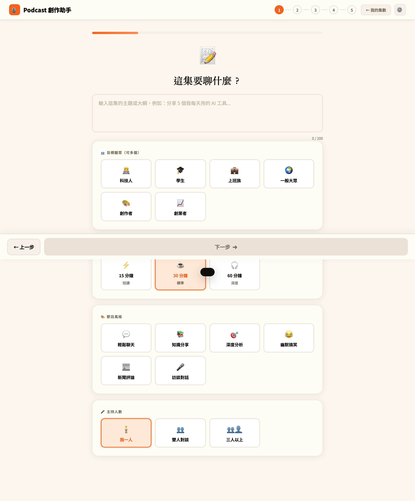
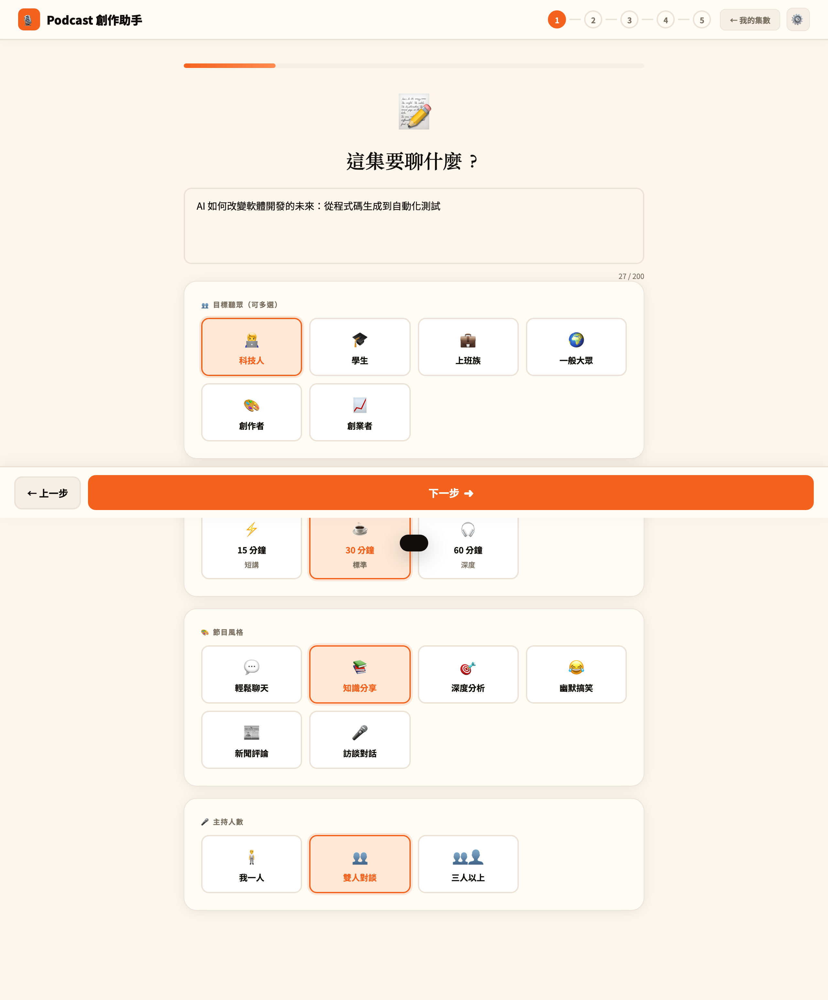
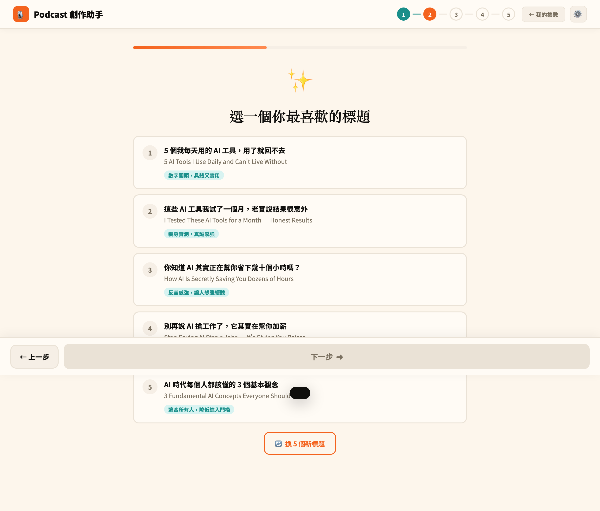
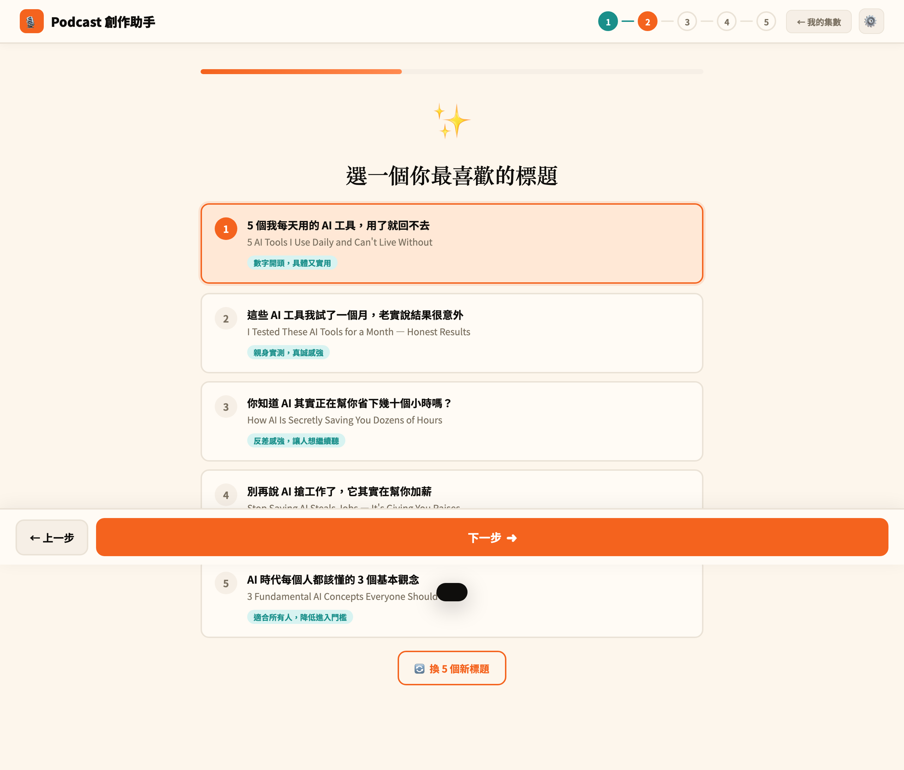
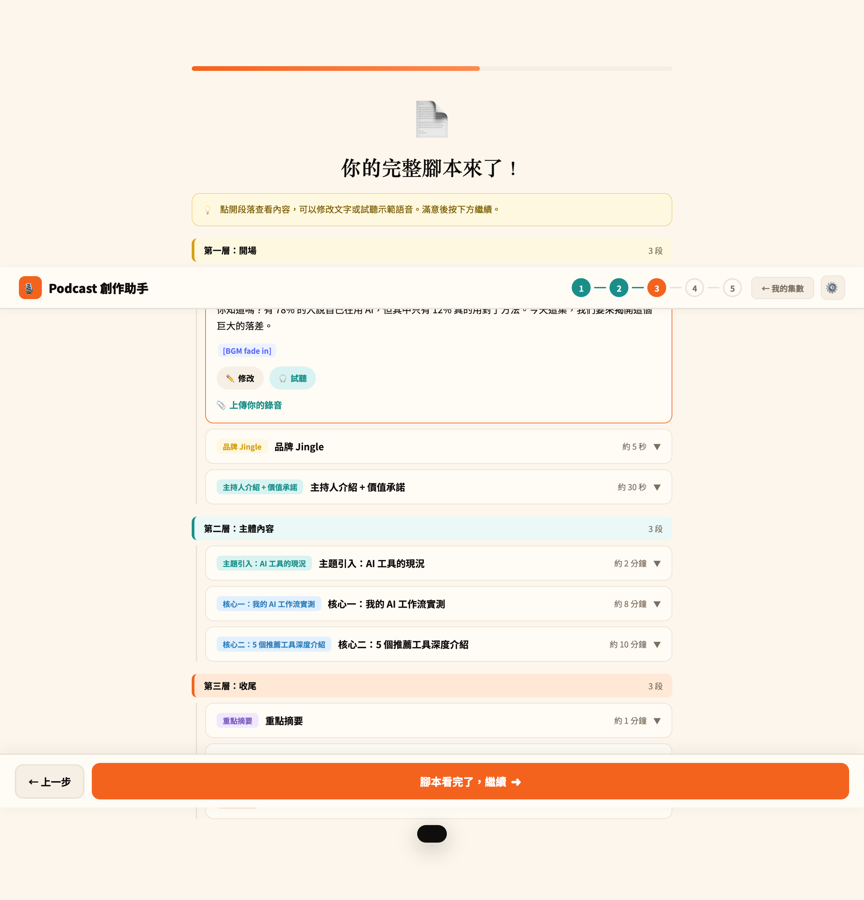
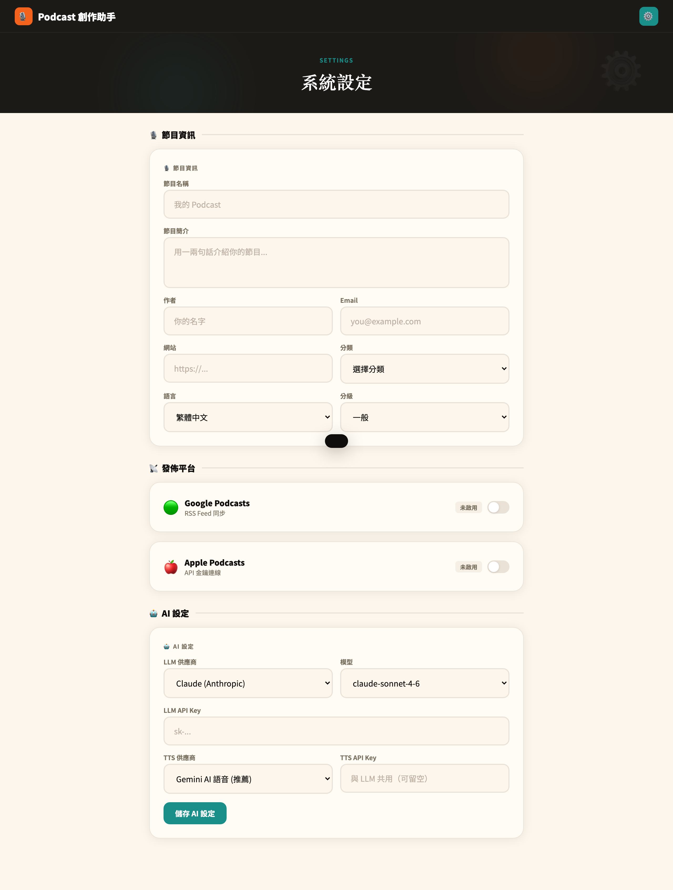

# Podcast 創作助手 - 使用手冊

> **版本**：1.0
> **最後更新**：2026-02-25

---

## 目錄

1. [系統簡介](#1-系統簡介)
2. [快速開始](#2-快速開始)
3. [主畫面（Dashboard）](#3-主畫面dashboard)
4. [建立新集數：五步驟工作流程](#4-建立新集數五步驟工作流程)
   - [步驟一：設定主題](#步驟一設定主題)
   - [步驟二：選擇標題](#步驟二選擇標題)
   - [步驟三：審閱腳本](#步驟三審閱腳本)
   - [步驟四：回饋與優化](#步驟四回饋與優化)
   - [步驟五：匯出腳本](#步驟五匯出腳本)
5. [集數管理](#5-集數管理)
6. [系統設定](#6-系統設定)
7. [快捷鍵](#7-快捷鍵)
8. [常見問題（FAQ）](#8-常見問題faq)

---

## 1. 系統簡介

**Podcast 創作助手** 是一款 AI 驅動的 Podcast 腳本生成工具，透過引導式的五步驟工作流程，幫助你從主題發想到完整腳本，快速產出結構化的 Podcast 內容。

系統採用「**三層十段**」腳本架構：

| 層次 | 段落 | 說明 |
|------|------|------|
| **第一層：開場** | 冷開場、品牌 Jingle、主持人介紹 | 吸引聽眾注意力，建立品牌印象 |
| **第二層：主體內容** | 主題引入、核心內容一、核心內容二 | 深入探討主題，傳遞核心價值 |
| **第三層：收尾** | 重點摘要、行動呼籲、下集預告 | 總結重點，引導聽眾互動 |

---

## 2. 快速開始

1. 打開瀏覽器，前往應用程式網址
2. 點擊「**＋ 建立新的一集**」按鈕
3. 填入主題 → AI 生成標題 → AI 生成腳本 → 審閱回饋 → 匯出下載
4. 完成！你的 Podcast 腳本已準備好

---

## 3. 主畫面（Dashboard）

主畫面是你管理所有 Podcast 集數的中心。

### 首次使用（空白狀態）

畫面元素說明：

| 區域 | 說明 |
|------|------|
| **頂部導覽列** | 左側顯示「Podcast 創作助手」品牌名稱，右側為設定按鈕（齒輪圖示） |
| **Hero 區域** | 深色背景區塊，包含「＋ 建立新的一集」主按鈕，以及快捷鍵提示（按 `N` 快速建立） |
| **統計列** | 顯示三組數據：全部集數、已完成、進行中 |
| **工具列** | 搜尋框、排序下拉選單（最新優先）、篩選按鈕（全部 / 進行中 / 已完成） |
| **集數列表** | 顯示所有集數卡片。首次使用時顯示空白提示，並有「＋ 建立第一集」按鈕 |

### 有集數時的畫面

建立集數後，主畫面會顯示**集數卡片**，每張卡片包含：

- **封面圖片**：隨機 emoji 與漸層色彩背景，標示集數編號（如 EP1）
- **狀態標籤**：「審閱腳本」表示進行中的步驟
- **標題**：集數主題名稱
- **標籤**：節目風格（如「知識分享」）與時長（如「30 分鐘」）
- **進度條**：顯示完成百分比（如 60%）
- **操作按鈕**：「繼續」可回到編輯流程

### 搜尋與篩選

- **搜尋**：在搜尋框輸入關鍵字，即時篩選符合的集數
- **排序**：點擊下拉選單，可選擇「最新優先」或「最舊優先」
- **篩選狀態**：點擊「全部」、「進行中」或「已完成」按鈕切換顯示

---

## 4. 建立新集數：五步驟工作流程

點擊「**＋ 建立新的一集**」後，進入五步驟引導式工作流程。畫面頂部會顯示步驟進度指示器（1 → 2 → 3 → 4 → 5），當前步驟會以橘色圓圈標示。

---

### 步驟一：設定主題

> 「這集要聊什麼？」

在此步驟中，你需要設定這集 Podcast 的基本資訊：

#### 1. 輸入主題

在文字輸入區填入這集的主題或大綱。右下角會顯示字數計數器（上限 200 字）。

> 例如：「AI 如何改變軟體開發的未來：從程式碼生成到自動化測試」

#### 2. 選擇目標聽眾（可多選）

點擊按鈕選擇你的目標聽眾，選中的按鈕會以橘色框線標示：

- 科技人
- 學生
- 上班族
- 一般大眾
- 創作者
- 創業者

#### 3. 選擇節目時長

從三個選項中選擇：

| 選項 | 時長 | 適用場景 |
|------|------|---------|
| 短講 | 15 分鐘 | 快速分享 |
| **標準** | **30 分鐘** | 一般節目（預設） |
| 深度 | 60 分鐘 | 深入探討 |

#### 4. 選擇節目風格

- 輕鬆聊天
- 知識分享
- 深度分析
- 幽默搞笑
- 新聞評論
- 訪談對話

#### 5. 選擇主持人數

- 我一人（獨白型）
- 雙人對談
- 三人以上

#### 填寫完成畫面

所有選項填寫完畢後，底部的「**下一步 ➜**」按鈕會變為橘色可點擊狀態。點擊即可進入下一步。

> 左下角的「← 上一步」按鈕可返回上一步驟。

---

### 步驟二：選擇標題

> 「選一個你最喜歡的標題」

點擊「下一步」後，系統會使用 AI 根據你的主題設定，自動生成 **5 個候選標題**。

每個標題卡片包含：

- **編號**（1-5）
- **中文標題**：主要顯示的標題
- **英文標題**：對應的英文翻譯
- **吸引力標籤**（橘色文字）：說明此標題為什麼吸引人（如「數字開頭，具體又實用」、「親身實測，真誠感強」）

#### 操作方式

1. **選擇標題**：點擊你最喜歡的標題卡片，選中的卡片會以橘色背景和框線標示

   

2. **重新生成**：如果不滿意，可點擊底部「**換 5 個新標題**」按鈕，AI 會重新生成一組

3. 選好標題後，點擊「**下一步 ➜**」進入腳本生成

---

### 步驟三：審閱腳本

> 「你的完整腳本來了！」

AI 會根據你選擇的標題與設定，生成完整的三層十段腳本。

頁面頂部會顯示操作提示：

> 「點開段落查看內容，可以修改文字或試聽示範語音。滿意後按下方繼續。」

#### 腳本結構

腳本按三層分組顯示，每一層以不同顏色的左邊界標示：

- **第一層：開場**（3 段）— 橘色
- **第二層：主體內容**（3 段）— 綠色
- **第三層：收尾**（3 段）— 紅色

每個段落卡片顯示：

| 元素 | 說明 |
|------|------|
| **類型標籤** | 彩色標籤，如「冷開場：驚人數據」、「品牌 Jingle」 |
| **段落名稱** | 段落的標題 |
| **預估時長** | 右側顯示（如「約 15 秒」、「約 8 分鐘」） |
| **展開/收合圖示** | 點擊 ▼ 展開查看內容，▲ 收合 |

#### 展開段落

點擊任一段落卡片可展開查看完整內容：

展開後可以看到：

- **完整腳本文字**：該段落的完整台詞
- **音效標註**：如 `[BGM fade in]` 等提示
- **修改按鈕**：點擊「修改」可開啟編輯視窗，手動修改腳本文字
- **試聽按鈕**：點擊「試聽」可使用 AI 語音合成（TTS）預覽語音效果
- **上傳錄音**：點擊「上傳你的錄音」可上傳自己的語音錄音

#### 完成審閱

確認腳本內容後，點擊底部「**腳本看完了，繼續 ➜**」進入回饋步驟。

---

### 步驟四：回饋與優化

> 「這個腳本好用嗎？」

此步驟讓你對生成的腳本進行評分與回饋，AI 可根據你的回饋重新優化腳本。

#### 評分區域

為腳本的三個面向打星（1-5 顆星）：

| 評分項目 | 說明 |
|---------|------|
| **自然程度** | 腳本讀起來是否自然流暢 |
| **節奏安排** | 各段落的時間分配是否合理 |
| **風格符合** | 是否符合你設定的節目風格 |

#### 意見回饋

- **文字輸入區**：自由填寫改進建議（提示：「哪裡可以改進？例如：開場太長、某段的比喻不夠生動...」）
- **快速回饋標籤**：點選常見問題標籤，快速標記需要改進之處：
  - 開場太長
  - 語氣太正式
  - 需要更多案例
  - 結尾不夠有力
  - 節奏太趕
  - 可以更有趣

#### 操作選項

- **重新優化腳本**（橘色主按鈕）：AI 根據你的評分和回饋，重新生成優化後的腳本，並返回步驟三讓你審閱新版本
- **滿意了，去下載腳本 →**（橘色外框按鈕）：跳過優化，直接進入匯出步驟

---

### 步驟五：匯出腳本

> 「腳本完成！」

完成所有步驟後，你會看到最終的匯出畫面，包含：

- **完成提示**：顯示「腳本完成！你的 Podcast 腳本已經準備好了。」
- **腳本預覽區**：顯示完整格式化的腳本文字，可上下捲動瀏覽
- **匯出按鈕**：
  - 「**複製腳本**」— 將全文複製到剪貼簿
  - 「**下載 .txt 檔**」— 下載為純文字檔案
- **導覽按鈕**：
  - 「← 回到集數列表」— 返回主畫面
  - 「＋ 新的一集」— 直接開始建立下一集

---

## 5. 集數管理

### 繼續編輯

在主畫面的集數卡片上，點擊「**繼續**」按鈕可以回到上次中斷的步驟繼續編輯。

### 刪除集數

點擊集數卡片右上角的刪除圖示，會彈出確認對話框：

- 「**取消**」：關閉對話框，不做任何操作
- 「**刪除**」（紅色按鈕）：永久刪除該集數及所有相關資料（此操作無法復原）

---

## 6. 系統設定

點擊右上角的**齒輪圖示**進入系統設定頁面。

設定頁面分為三個區塊：

### 節目資訊

設定你的 Podcast 基本資料：

| 欄位 | 說明 |
|------|------|
| 節目名稱 | 你的 Podcast 名稱 |
| 節目簡介 | 一兩句話介紹你的節目 |
| 作者 | 你的名字 |
| Email | 聯絡信箱 |
| 網站 | 節目網站網址 |
| 分類 | 節目分類（下拉選擇） |
| 語言 | 節目語言（預設繁體中文） |
| 分級 | 內容分級（預設一般） |

### 發佈平台

可設定同步發佈至：

- **Google Podcasts**：RSS Feed 同步（開關切換）
- **Apple Podcasts**：API 金鑰連線（開關切換）

### AI 設定

設定 AI 模型與語音合成相關參數：

| 欄位 | 說明 |
|------|------|
| LLM 供應商 | 選擇語言模型供應商（Claude / Gemini） |
| 模型 | 選擇具體模型版本 |
| LLM API Key | 填入對應的 API 金鑰 |
| TTS 供應商 | 選擇語音合成供應商（預設 Gemini AI 語音） |
| TTS API Key | TTS 金鑰（若與 LLM 共用可留空） |

設定完成後，點擊「**儲存 AI 設定**」按鈕儲存。

---

## 7. 快捷鍵

| 快捷鍵 | 功能 |
|--------|------|
| `N` | 在主畫面快速建立新集數 |

---

## 8. 常見問題（FAQ）

### Q：AI 生成標題/腳本需要多久？

視 AI 供應商和模型而定，通常：
- 標題生成：5-15 秒
- 腳本生成：15-60 秒

生成期間畫面會顯示載入動畫，請耐心等待。

### Q：可以修改 AI 生成的腳本嗎？

可以。在步驟三的腳本審閱頁面，展開任意段落後點擊「修改」按鈕，即可開啟編輯視窗手動修改文字。

### Q：回饋優化可以做幾次？

沒有次數限制。你可以在步驟四反覆提交回饋，AI 會根據你的意見持續優化腳本，直到你滿意為止。

### Q：腳本可以匯出為什麼格式？

目前支援：
- **複製到剪貼簿**：可貼到任何文字編輯器
- **下載 .txt 檔**：純文字檔案格式

### Q：需要自己準備 API Key 嗎？

是的。系統使用第三方 AI 服務（Gemini 或 Claude），你需要在設定頁面填入對應的 API Key。API Key 會經過加密儲存在伺服器端。

### Q：我的資料安全嗎？

系統使用匿名的使用者 ID（儲存在瀏覽器 localStorage 中），不需要註冊或登入。你的腳本資料儲存在伺服器端，與你的使用者 ID 綁定。

### Q：試聽功能支援哪些語音？

使用 Gemini AI TTS 語音合成服務，支援多達 30 種不同聲線，可在試聽視窗中選擇偏好的聲音。

---

*本手冊由 Podcast 創作助手團隊編寫。如有問題或建議，歡迎來信聯繫。*
